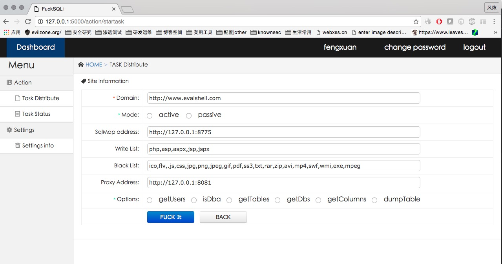
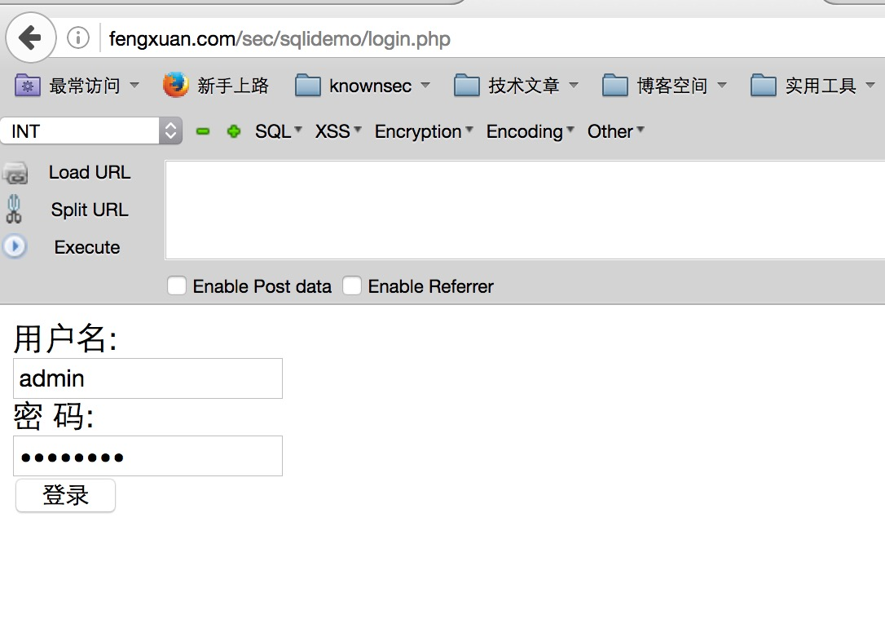
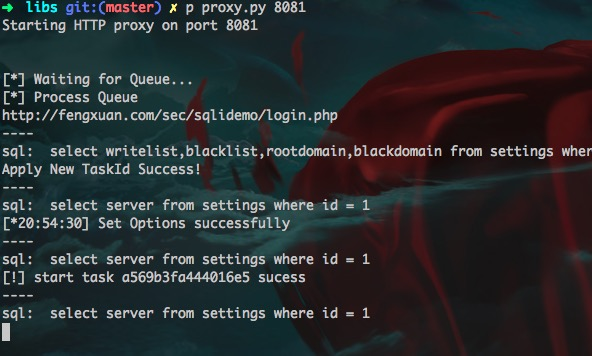
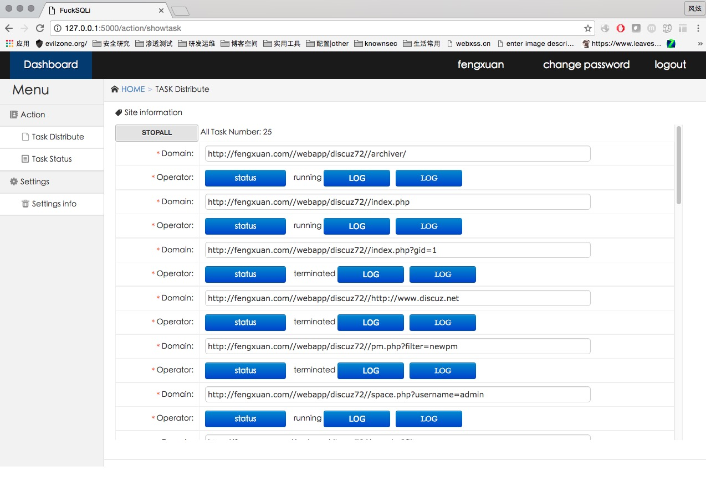
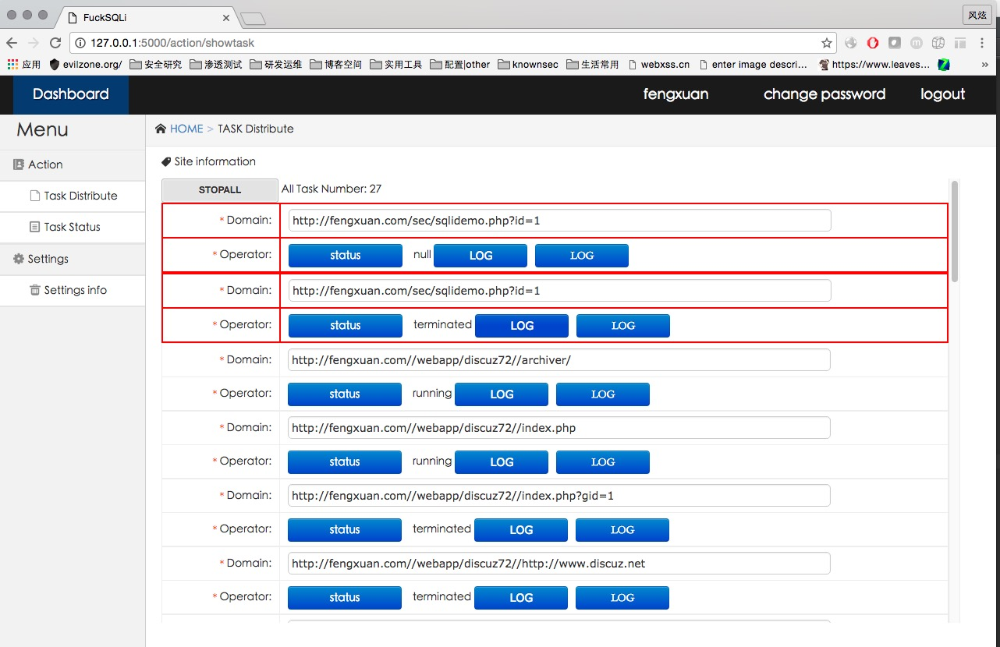
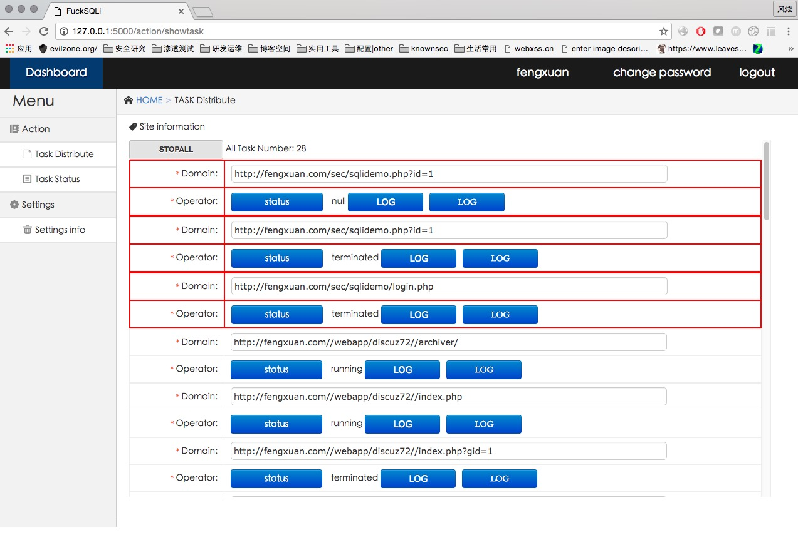

#Fox-scan

Fox-scan is a initiative and passive SQL Injection vulnerable Test tools.
use for penetration testing!

Foxscan 是一个款基于SQLMAP的主动和被动资源发现的漏洞扫描工具,在设置浏览器代理后访问目标网站即可获取浏览器访问的链接,并且进行简单的爬虫获取链接,去除一些静态文件和第三方网站后，放入sqlmap中进行检测。

##INSTALl
###Environment
```
sqlmap
python 2.7 
Flask
multiprocessing
tornado
requests
BeautifulSoup 4.2.0
```

###Settings
配置项目根目录下config.xml
    
    <root>
        <mysql>
        <host>127.0.0.1</host>
        <username>root</username>
        <password>123480</password>
        <port>3306</port>
        <database>foxscan</database>
        <charset>utf8</charset>
    </mysql>
    <sqlmap>
        http://127.0.0.1:8775 
    </sqlmap>
    <typelist>
        <whitelist>.php,.asp,.aspx,.jsp,.jspx</whitelist>
        <blacklist>
          .ico,.flv,.js,.css,.jpg,.png,.jpeg,.gif,.pdf,.ss3,.txt,.rar,.zip,.avi,.mp4,.swf,.wmi,.exe,.mpeg
         </blacklist>
    </typelist>
    </root>

sqlmap标签为你的sqlmap地址,typelist类型设置为黑名单和白名单设置,用于爬虫用。默认可以不用改。

###DATABASE

    CREATE DATABASE `foxscan` DEFAULT CHARACTER SET utf8 COLLATE utf8_general_ci;
    
    source foxscan.sql

##Run

 1 首先运行sqlmapapi.py
 
  ```  
  python sqlmapapi.py -s
  ```

 2 运行本程序WEB界面
 
 ```
 python views.py
 ```
 
 3 打开浏览器输入控制台提示的访问地址(这里是http://127.0.0.1:8775) 在这里配置你的目标网站,sqlmap的地址,爬虫的过滤类型以及代理地址。 
 
  1. <strong>这里的Domain，即代表爬虫的时候不会获取这个根域名之外的网站链接,同一时刻只能添加一次目标</strong>
  2. <strong>需要更改目标的话需要重新进入这个界面配置,但是会删除之前的所有在跑的任务</strong>

 
 
 
 4 在配置完任务信息后,可以进入到libs目录中,运行
 
 ```
   python proxy.py 8081
 ```
  启动本地代理服务器,然后再配置浏览器代理，即可达到被动扫描的效果
  例如：
  
  
  
  写了一个很简单的POST登录框。
  控制台输出这样的字样后代表加入队列扫描
  
  
  
  如果没有,说明是第三方网站或者访问的是静态文件资源,则不会加入到扫描队列中！


 5 配置完成之后点击FUCK IT按钮,就会提示你成功添加一个目标,进入到任务详情页。
 这里会显示说有在跑的任务,使用AJAX请求每3秒刷新一次。
 
 
 
 <strong>如果有成功的目标,就会显示为红色</strong>

 
 
 可以看到我们刚才的POST注入已经扫描完成。

 


##TODO 
 基本可以使用,但是还是有一些BUG。
 BUG:
 
   1. AJAX刷新有时候不能正确实时展示。
   2. 代理功能有时候在数据库不支持长链接的情况下会报错
   
 还有一些功能未能实现
 FEATURE:

 1. 点击LOG,可以查看扫描日志
 2. 添加PAYLOAD选项,可以查看到PAYLOAD

##License
  
 > + fengxuan - ***mOon Security Team***  2016/09/03

  

 


    
    
    
    
    
    
    
  